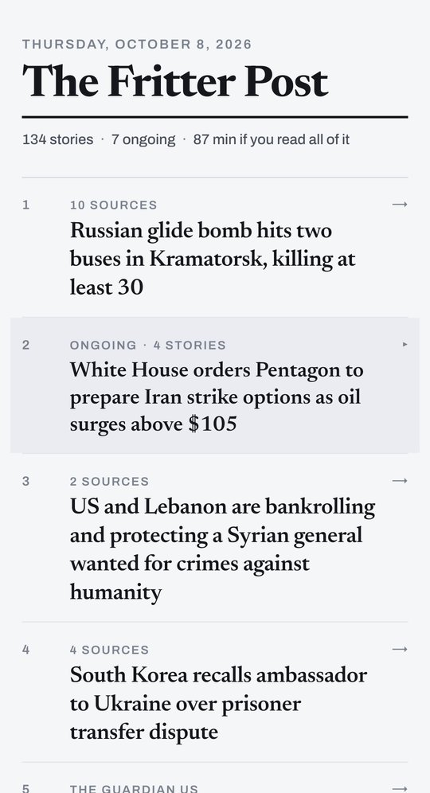
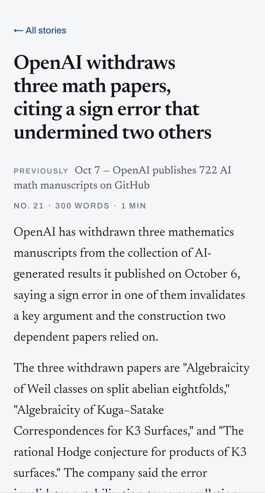
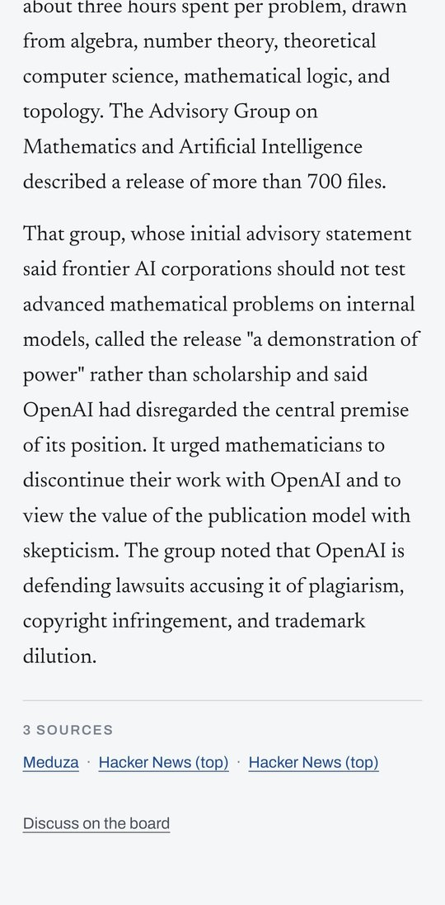

# The Fritter Post

A daily newspaper for one reader.

Every morning at six a pipeline reads 111 news sources and works out what
happened. It decides what matters to one specific person, using a profile the
reader wrote, and writes about 150 pieces in a house voice, each linking
out to the reporting it came from. The result is published as a finite paper at
post.fritter.lol: ranked rather than sectioned, with no feed, no ads and no
engagement metrics. When you reach the end, you're done.

It's a personal project, self-hosted on one box, and it's not a product.

<p align="center">
  
  &nbsp;
  
  &nbsp;
  
</p>

<p align="center"><sub>
The front page is the whole paper, in rank order: rank 2 is an ongoing story that opens into four pieces.
An article says what the paper ran on it before.
Its sources sit at the foot, and they are the only colour on the page.
</sub></p>

---

## How it works

```
GATHER       collect → preprocess → screen
UNDERSTAND   cluster → score → novelty → thread
PRODUCE      rank → fetch → write → publish
```

| step | what it does |
|---|---|
| **collect** | Fetches 111 RSS feeds and news sitemaps. No judgment and no dedup: the same story from five outlets is a signal. |
| **preprocess** | Canonicalizes URLs, removes duplicate articles, translates non-English items, and cuts link dumps by rule. |
| **screen** | An LLM gives each item a verdict against the reader's bio: cut, news or opinion. When unsure, it keeps. |
| **cluster** | Embeds every item and groups the ones that report the same event. LLM passes split chains, attach near-misses and name each cluster. |
| **score** | Rates every event for this reader on two axes, *interest* and *consequence*. Software adds them up. |
| **novelty** | Compares each story with the last week's papers: new, a development, a minor update, routine, or a rerun. Reruns are withheld and minor updates shrink. |
| **thread** | Groups events into ongoing situations (one war, one state's fire season) so the paper covers a situation once, as a section. |
| **rank** | Builds the front page by formula: `score + 9·ln(outlets reporting it)`. Rank decides each piece's size: feature, standard or brief. |
| **fetch** | Gets the full article text where the feed only carried a teaser. The text is used for writing and never published. |
| **write** | One LLM call per piece, given the sources, the reader, a word target and the standing memo on voice. |
| **publish** | Freezes the paper with its source links, and marks stories the paper has covered before ("Previously…"). |

A full run takes about 15 minutes. `docs/design.md` covers each stage in detail.

## What's interesting about it

- **LLMs judge and software decides.** Models answer narrow questions, such as
  whether two articles are the same event or how much a story matters to this
  reader. The ranking is a formula over those answers, and no model is asked to
  lay out the front page.
- **"Same event" and "same story" are different questions.** Clustering groups
  articles about one event. Threading groups events into one situation. Keeping
  the two apart lets clustering stay strict without the paper losing the
  connection.
- **Novelty, not dedup.** The repeats that matter are yesterday's news reported
  by a different outlet today. They share no URL or title with what was
  printed, so a dedup key can't catch them. A judge grades how new each story
  is against what the reader has already been told.
- **A stage that exits 0 hasn't necessarily worked.** A rate-limited call that
  comes back empty looks exactly like a model saying "none of these". So every
  stage records the counters that tell those apart, and the runner reads them
  back through a gate between stages before going on.
- **A model repeats what the prompt says about itself.** Tell a writer its
  source is "truncated" and the reader gets a sentence about truncation. The
  writer prompts never describe their own plumbing.
- **Everything is traceable.** Every LLM call is logged with its full prompts.
  Every published piece traces back through its cluster to the raw items, and
  every piece links to its sources.

The editorial stance (plain headlines, named actors, symmetric skepticism,
"curate, don't reproduce") is set out in `docs/concept.md` and `docs/voice.md`.

## Stack

- TypeScript, Next.js (App Router) for the reading view.
- PostgreSQL with pgvector, in the same docker-compose stack.
- LLMs through the OpenAI SDK against OpenAI-compatible providers. Each stage
  picks its model in `config/models.yaml`: GLM for judgment, DeepSeek for
  writing, Qwen3 for embeddings.
- A systemd timer generated from config.

## Running it locally

Prerequisites: Node 22+ and PostgreSQL with the pgvector extension.

```bash
npm install
cp .env.example .env        # set DATABASE_URL and the provider keys
npm run migrate
npm run dev                 # the reading view at http://localhost:3000
```

```bash
npm run typecheck
npm test
npm run pipeline -- --dry-run          # print the plan, run nothing
npm run pipeline                       # make a paper
npm run inspect -- pipeline --id <n>   # what happened, gate by gate
```

Every stage also runs on its own (`npm run collect`, `npm run screen`,
`npm run score`, …) and has an `inspect` view. `CLAUDE.md` lists all the
commands. To write a paper for someone other than John, replace `docs/bio.md`;
`docs/bio.example.md` shows the shape.

## Repository

```
config/        models.yaml (per-stage models, budgets, gates), sources.yaml
docs/          concept, design, operations, decisions, open items, bio, voice
migrations/    numbered SQL
scripts/       one CLI per stage, plus inspect, experiments and the test runner
src/pipeline/  one directory per stage, plus runner/
src/llm/       the LLM wrapper: logging, streaming, backoff
src/app/       the reading view
tests/         unit tests for the deterministic parts
```

## Documentation

| question | file |
|---|---|
| What is this for, and what is it not? | `docs/concept.md` |
| How is it built? | `docs/design.md` |
| Why is it built that way? | `docs/decisions.md` (dated, with an index) |
| What's known to be wrong? | `docs/open-items.md` |
| How is it deployed and run? | `docs/operations.md` |
| Who is the reader? How does the paper sound? | `docs/bio.md`, `docs/voice.md` |
| How should an agent work in this repo? | `CLAUDE.md` |
